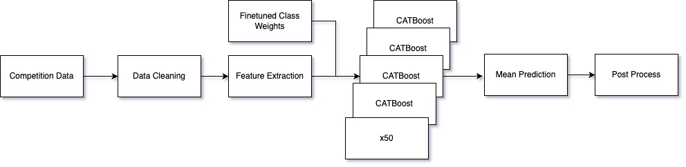
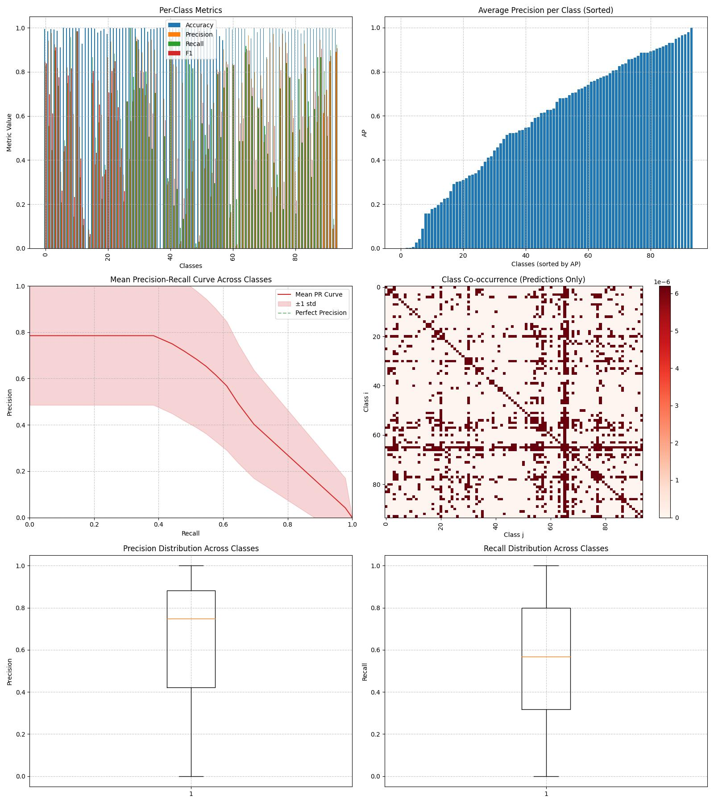
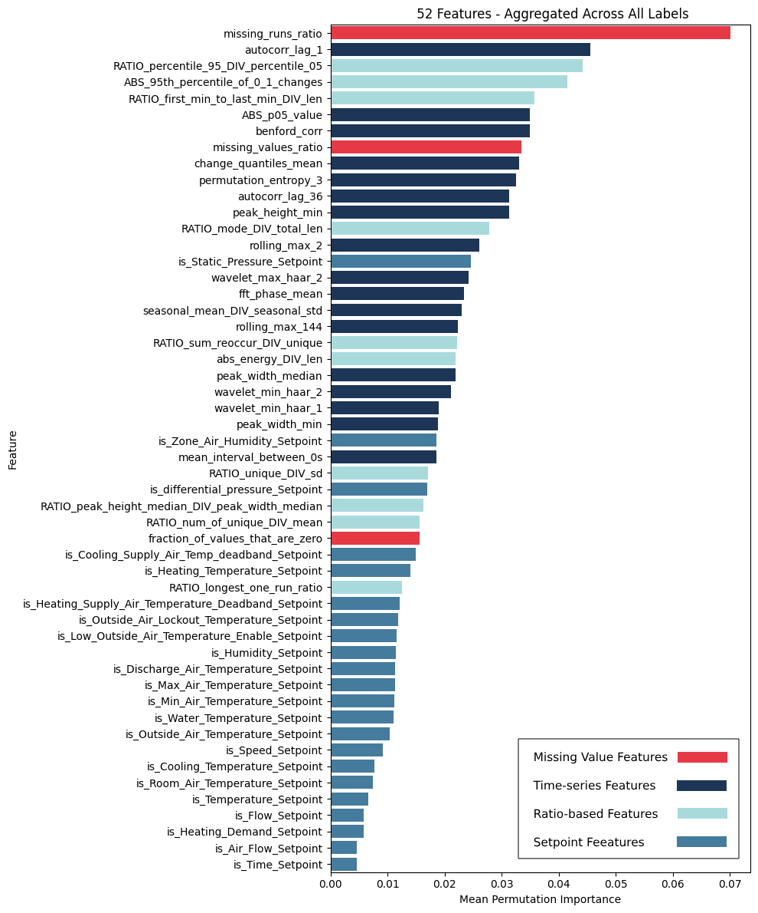

# BrickMIR: 
## A Minimal, Imbalance-tuned, and Ratio-based Framework for Brick Metadata Classification

This repository contains the solution for BrickMIR, developed for the Brick by Brick 2024 challenge focused on automating building timeseries data classification.

---

We propose a multi-label time-series classification framework for building metadata labeling. Rather than relying on absolute values (which vary widely across different buildings), we focus on ratio- and correlation-based features that capture each sensor’s relative behavior. Along with minimal data cleaning and label-tuned class weights, this approach generalizes well across buildings with differing baselines, as demonstrated on the Brick by Brick 2024.

## Directory Structure

| Folder/File                     | Description                                                                 | Platform         |
|----------------------------------|-----------------------------------------------------------------------------|------------------|
| **train_X/**                     | Raw training files.                                                         | -                |
| **train_X_cleaned/**             | Contains cleaned train files, created by `data_cleaning.py`.                 | -            |
| **test_X/**                      | Raw test files.                                                             | -                |
| **test_X_cleaned/**              | Contains cleaned test files, created by `data_cleaning.py`.                  | -            |
| **data_cleaning.py**             | Script for cleaning and processing the training files.                       | Local            |
| **feature_extraction.py**        | Contains the feature engineering logic.                                      | Local            |
| **process_train_test.py**        | Runs feature extraction on both train and test sets.                         | Local            |
| **scale_factor_tuning.ipynb**    | Notebook for tuning the scaling factors for each label.                      | Local            |
| **model_train_predict.ipynb**    | Notebook for model training and prediction.                                  | Google Colab     |
| **post_processing.ipynb**        | Directory containing scripts to enforce Brick class hierarchy on predictions. | Google Colab     |

---

## Pipeline Order

1. **Download Raw Data**  
   Download all the raw train and test files from the competition website and place them in the root folder.

2. **Data Cleaning**  
   Run `data_cleaning.py` locally to clean and process raw training and test files.

3. **Feature Extraction**  
   Execute `process_train_test.py` locally to perform feature engineering on the cleaned datasets.

4. **Scale Factor Tuning**  
   Perform the scale factor tuning in the `scale_factor_tuning.ipynb`.  
   *(Note: This step is done, and the tuned parameters are in the model training script.)*

5. **Model Training & Prediction**  
   Use `model_train_predict.ipynb` on Colab for training the model and generating predictions.

6. **Post Processing (Optional)**  
   Run the scripts in the `post_processing` folder to enforce the Brick class hierarchy on the predictions.  
   *(Note: This step is optional and is not part of the final submission.)*

## Local CV vs. Public Leaderboard

| **Data**            | **F1**  | **Precision** | **Recall** |
|---------------------|---------|---------------|------------|
| Local CV            | 0.707   | 0.716         | 0.720      |
| Public Leaderboard  | 0.559   | 0.665         | 0.553      |

---

## Best Public Leaderboard Submission

## Permutation Importance

---

## Acknowledgments

This repository is a part of the Brick by Brick 2024 challenge. Special thanks to the organizers and the community for their support.